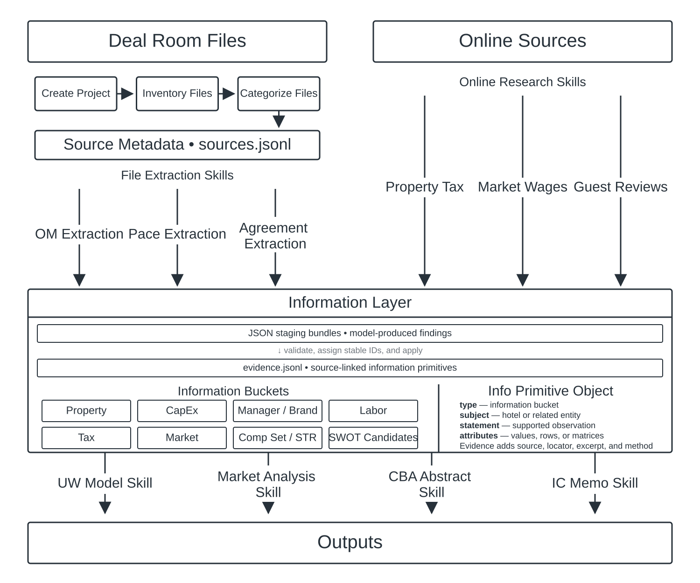

# Hotel Underwriting Skills

A source-backed Codex plugin for organizing hotel deal rooms, extracting local-file evidence, and researching current online information for underwriting.

Follow the [getting started guide](./GETTING_STARTED.md) to begin.



## What is included

- 3 organizational skills for project setup, inventory, and file categorization.
- 7 file-extraction skills covering OMs, property tax, booking pace, STR, CapEx, labor staffing, and management/franchise agreements.
- 7 online-research skills covering tax rules and history, union status, wages, reviews, Cvent, and official hotel websites.
- Shared contracts, schemas, source-access rules, meeting-space counting rules, validation scripts, and tests.

See the [skill and information-bucket catalog](./CATALOG.md) for the complete inventory.

## Data architecture

- Project contracts live in `.hotel-underwriting/` inside each deal room.
- Local and web sources are versioned in `sources.jsonl`.
- Model-produced findings are saved as reviewable JSON staging bundles.
- Validation assigns stable IDs and writes source-linked information primitives to `evidence.jsonl`.
- Current extraction and research skills do not write `facts.jsonl`.
- The deterministic STR parser writes validated `property.str` evidence directly.

## Development and tests

Python 3 is required. Runtime dependencies are listed in `requirements.txt`; the full test suite also uses `pytest`.

```powershell
python -m pip install -r requirements-dev.txt
python -m pytest plugins/hotel-underwriting/tests
```

Plugin manifest validation can be run with Codex's bundled `plugin-creator` validator.
